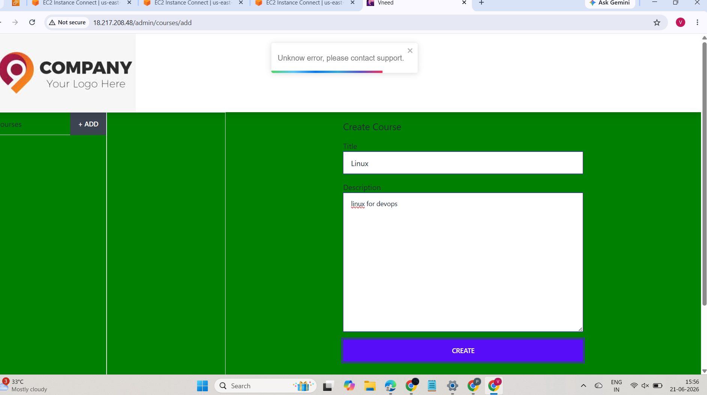
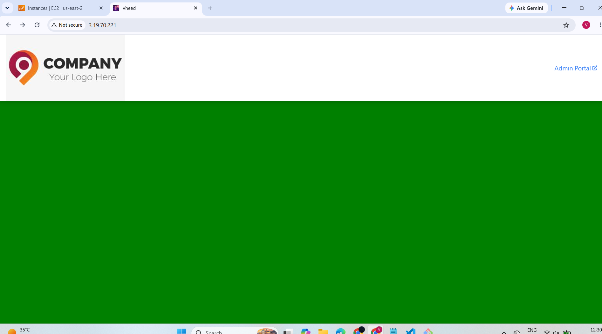

# LMS 3-Tier Application Deployment on AWS

A full-stack Learning Management System (LMS) deployed on AWS using a 3-tier architecture. This project demonstrates cloud infrastructure provisioning, application deployment, containerization, networking, and troubleshooting using AWS EC2, Docker, ReactJS, NodeJS, and PostgreSQL.

---

## Project Overview

This project follows a 3-tier architecture:

* **Presentation Tier** – ReactJS Frontend
* **Application Tier** – NodeJS & ExpressJS Backend API
* **Data Tier** – PostgreSQL Database

Each tier is deployed on a separate AWS EC2 instance to ensure scalability, maintainability, and separation of concerns.

---

## 3-Tier Architecture

```text
                    Internet Users
                           │
                           ▼
               Frontend EC2 Instance
                  ReactJS + Nginx
                     Port 80
                           │
                           ▼
                Backend EC2 Instance
                NodeJS + Express API
                    Port 3000
                           │
                           ▼
               Database EC2 Instance
                    PostgreSQL
                     Port 5432
```

---

## Technologies Used

<p align="center">
  
<b>Frontend:</b> • ReactJS  • Vite  • Nginx<br><br>

<b>Application:</b> • NodeJS  • ExpressJS  • Prisma ORM<br><br>

<b>Database:</b> • PostgreSQL<br><br>

<b>DevOps:</b> • Docker  • Docker Compose  • Git  • GitHub<br><br>

<b>AWS:</b>  • EC2  • Security Groups  • Ubuntu Linux
</p>

---

## AWS Infrastructure

| EC2 Instance | Purpose             |
| ------------ | ------------------- |
| LMS-Frontend | ReactJS Frontend    |
| LMS-Backend  | NodeJS Backend API  |
| LMS-Database | PostgreSQL Database |

---

## Container Information

| Container  | Purpose           | Port |
| ---------- | ----------------- | ---- |
| Frontend   | React Application | 80   |
| Backend    | NodeJS API        | 3000 |
| PostgreSQL | Database          | 5432 |

---

## Security Group Configuration

| Port | Purpose                    |
| ---- | -------------------------- |
| 22   | SSH Access                 |
| 80   | Frontend Access            |
| 3000 | Backend API Access         |
| 5432 | PostgreSQL Database Access |

---

## Deployment Steps

### 1. Launch AWS EC2 Instances

Create three Ubuntu EC2 instances:

* Frontend Server
* Backend Server
* Database Server

### 2. Install Docker

```bash
sudo apt update
sudo apt install docker.io -y
sudo systemctl enable docker
sudo systemctl start docker
```

### 3. Clone Repository

```bash
git clone https://github.com/VeeraBabu-Devops/LMS-Deployment-AWS.git

cd LMS-Deployment-AWS
```

### 4. Deploy Application

```bash
sudo docker compose up -d
```

### 5. Verify Running Containers

```bash
sudo docker ps
```

---

## Application Verification

Frontend Application:

```text
http://<frontend-public-ip>
```

Admin Portal:

```text
http://<frontend-public-ip>/admin
```

Backend API:

```text
http://<backend-public-ip>:3000/api
```

---

## Screenshots

### EC2 Infrastructure

Three AWS EC2 instances created for Frontend, Backend, and Database tiers.


---

### Application Home Page

Successfully deployed LMS frontend application accessible through the public IP.


---

### Admin Portal

Admin dashboard used for managing courses and LMS content.



---

### Troubleshooting & Debugging

During deployment, several issues were encountered and resolved:

* Frontend to Backend API connectivity issues
* Docker container communication problems
* Environment variable configuration issues
* Prisma database connection troubleshooting
* Course creation API errors



---

## Challenges Faced

* Docker networking configuration
* API communication between tiers
* Environment variable management
* PostgreSQL connectivity issues
* Prisma migration troubleshooting
* Course creation API debugging
* Nginx reverse proxy configuration

---

## Future Enhancements

* Jenkins CI/CD Pipeline
* SonarQube Integration
* Nexus Repository Manager
* Terraform Infrastructure Automation
* Kubernetes Deployment
* AWS CloudFront
* AWS WAF
* Route53 Custom Domain
* SSL/TLS with HTTPS

---

## Author

**Veera Babu Paidikondala**

GitHub: https://github.com/VeeraBabu-Devops

LinkedIn: https://www.linkedin.com/in/veera-babu-3264b9214/
